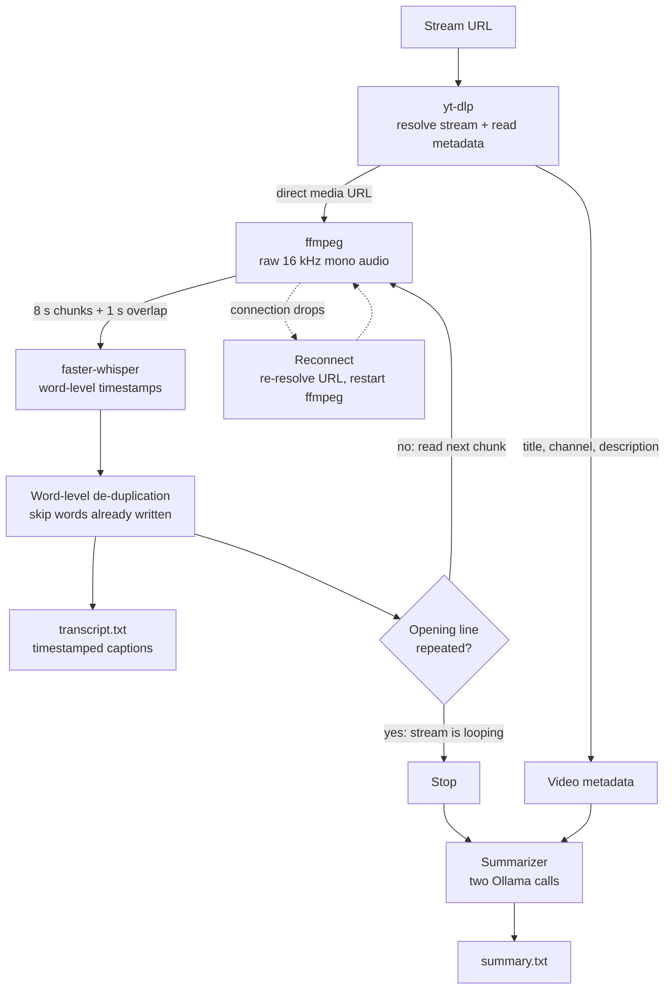
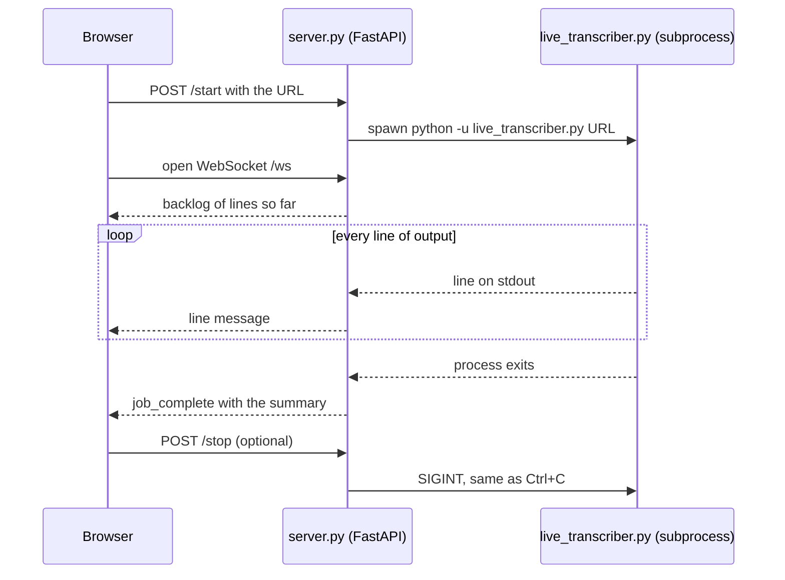

# Live Stream Transcriber

Transcribes a live video stream (YouTube Live, Twitch, or anything
[yt-dlp](https://github.com/yt-dlp/yt-dlp) supports) in near-real-time and
writes timestamped captions to a plain text file as it goes.

## How it works

1. **yt-dlp** resolves the stream URL into a direct media URL and collects the
   video's metadata (title, channel, description, tags).
2. **ffmpeg** decodes that stream to raw 16 kHz mono audio, piped straight into
   Python.
3. Audio is read in chunks (8 seconds by default). Each chunk is prefixed with
   a short overlap (1 second by default) from the end of the previous chunk, so
   Whisper has context across the boundary and doesn't cut words in half.
4. **faster-whisper** (a fast reimplementation of OpenAI's Whisper) transcribes
   each chunk locally, with word-level timestamps.
5. Words are checked against the end time of the last word already written, so
   nothing is repeated and, unlike a fixed overlap window, nothing is lost.
   Each caption is appended to the output file as:

   ```
   [00:00:12.400 --> 00:00:15.800] This is an example caption.
   [00:00:15.800 --> 00:00:19.100] Another line of transcribed speech.
   ```

   The file is flushed after every line, so you can watch it live with
   `tail -f transcript.txt`.
6. If the connection drops (network hiccup, the CDN rotating the stream URL),
   the script re-resolves the URL and restarts ffmpeg, up to `--max-retries`
   times, then exits cleanly with everything captured so far saved.
7. Some "live" streams are really a short video looped 24/7. ffmpeg never
   disconnects on those, so the script would transcribe the same content
   forever. It remembers the first substantial caption as a signature, and once
   a later caption closely matches it again (after `--loop-grace-seconds`, so
   the opening line isn't matched against itself) it treats that as the video
   looping back to the start and stops.
8. When transcription stops (loop detected, stream ended, `--stop-after-seconds`,
   or Ctrl+C), the transcript is sent to a local Ollama model, together with the
   video's metadata, to write a short summary to `summary.txt`. See
   [Summarization](#summarization-ollama).

## Setup

1. Install [ffmpeg](https://ffmpeg.org/download.html) and make sure it's on
   your PATH (`ffmpeg -version` should work in a terminal).
2. Install Python dependencies:

   ```bash
   pip install -r requirements.txt
   ```

   The first run will also download the Whisper model weights
   (a few hundred MB depending on model size) — this requires internet
   access once, then it's cached locally.

3. **Install a JavaScript runtime (required for YouTube).** yt-dlp now needs
   an external JS runtime to solve YouTube's challenges; without one,
   YouTube URLs can fail with "Sign in to confirm you're not a bot". This is
   a system program, not a pip package, so it can't go in `requirements.txt`.
   [Deno](https://docs.deno.com/runtime/getting_started/installation/) is
   recommended (version 2.3.0 or newer) and is picked up automatically once
   it's on your `PATH`. Check with `deno --version`. See yt-dlp's
   [EJS guide](https://github.com/yt-dlp/yt-dlp/wiki/EJS) for alternatives
   such as Node 22+.

4. **(Optional, GPU users only)** If you want `--device cuda` for
   GPU-accelerated Whisper transcription, install the CUDA packages
   separately:

   ```bash
   pip install -r requirements-cuda.txt
   ```

   This is **not** included in the default install on purpose — these
   packages are large (the cuDNN download alone is about 770 MB) and have been known to get OOM-killed on
   machines with limited RAM. CPU mode (the default) doesn't need this at
   all; only bother with it if you have a GPU with enough VRAM and RAM
   free to spare, and even then it's genuinely optional.

## Usage

```bash
python live_transcriber.py "https://www.youtube.com/watch?v=XXXXXXXX"
```

Common options:

```bash
python live_transcriber.py "https://www.twitch.tv/somechannel" \
    --output transcript.txt \
    --model small \
    --chunk-seconds 8 \
    --overlap-seconds 1 \
    --language en \
    --max-retries 5 \
    --retry-delay 5
```

| Flag                | Default          | Description                                                                                          |
|---------------------|------------------|--------------------------------------------------------------------------------------------------------|
| `--config`          | auto-detect      | Path to a YAML config file (see Config file); `config.yaml` is picked up automatically |
| `--output`          | `transcript.txt` | Path to the output text file                                                                           |
| `--model`           | `small`          | Whisper model size: `tiny`, `base`, `small`, `medium`, `large-v3`                                       |
| `--chunk-seconds`   | `8.0`            | Length of each new audio chunk sent to the model                                                       |
| `--overlap-seconds` | `1.0`            | Seconds of the previous chunk re-included as context, to avoid cutting words at chunk boundaries       |
| `--language`        | auto-detect      | Force a language code (e.g. `en`, `es`) to skip language detection                                     |
| `--device`          | `cpu`            | `cpu` or `cuda` (use `cuda` if you have an NVIDIA GPU + CUDA installed)                                 |
| `--max-retries`     | `5`              | Max consecutive reconnect attempts if the stream connection drops before giving up                      |
| `--retry-delay`     | `5.0`            | Seconds to wait between reconnect attempts                                                             |
| `--stop-after-seconds` | none          | Hard cutoff: stop after this many seconds of stream audio, regardless of anything else                 |
| `--no-loop-detect`  | (detect on)      | Disable automatic detection of looping/repeating streams (see below)                                    |
| `--loop-similarity` | `0.85`           | How closely a later caption must match the opening line to be treated as a loop restart (0-1)           |
| `--loop-grace-seconds` | `15.0`        | Don't check for loop repeats until this many seconds have played, so the opening line isn't self-matched|
| `--no-summarize`    | (summary on)     | Disable the end-of-run Ollama summary step                                                              |
| `--summary-output`  | `summary.txt`    | Output path for the generated summary                                                                   |
| `--ollama-model`    | `llama3.2`       | Ollama model to use for summarization (must already be pulled)                                          |
| `--ollama-host`     | `http://localhost:11434` | Base URL of the Ollama server                                                                 |
| `--ollama-temperature` | `0.2`         | Summary temperature, 0-1; lower is more literal and less likely to invent details              |

Press `Ctrl+C` to stop transcribing at any time.

## Config file

Retyping the same flags every run gets old fast. Instead, copy
`config.example.yaml` to `config.yaml` in this directory and set your
usual defaults there:

```bash
cp config.example.yaml config.yaml
```

The script automatically loads `config.yaml` if it's present - no flag
needed. Any flag you *do* pass on the command line always overrides the
config file, so day-to-day this becomes:

```bash
python live_transcriber.py "https://www.youtube.com/watch?v=XXXXXXXX"
```

and you only add flags when you want to deviate from your usual setup for
that one run. `config.yaml` is gitignored since it's your personal local
setup, not something to commit - `config.example.yaml` is the template
that stays in the repo.

To use a differently-named or differently-located config file:

```bash
python live_transcriber.py "URL" --config my-other-config.yaml
```

Precedence, highest to lowest: **CLI flag > config file > built-in
default**. Unrecognized keys in the config file print a warning (typo
protection) rather than silently doing nothing.

## Summarization (Ollama)

Summarization runs locally through [Ollama](https://ollama.com) — no API
key, no data leaving your machine.

**One-time setup:**

```bash
# Install Ollama: see https://ollama.com/download
ollama serve &          # if it isn't already running as a service
ollama pull llama3.2    # or any other model you prefer
```

Summarization is on by default. After the transcript finishes, you'll see:

```
Generating summary via Ollama (model: llama3.2)...
Summary written to: /path/to/summary.txt
```

To skip it, pass `--no-summarize`. To use a different model or a
non-default Ollama host:

```bash
python live_transcriber.py "https://www.youtube.com/watch?v=XXXXXXXX" \
    --ollama-model mistral \
    --ollama-host http://localhost:11434
```

If Ollama isn't running or the model isn't pulled, the script prints a
clear error but still keeps your transcript — only the summary step fails.

### How the summary is built

When video metadata is available, the summary is made in two small, separate
model calls rather than one large one, because small local models become
unreliable when a single prompt asks for too many things at once:

1. **Context:** the model describes what the video contains, using only the
   metadata. The `Video:` and `Channel:` lines above that description are
   copied from the metadata by code, not written by the model. (A small model
   once misread a video title and presented part of it as the film's name.)
2. **What Was Said:** the model summarizes the transcript, using the first
   call's output only to know who is speaking.

Both calls use a low temperature (`--ollama-temperature`, default 0.2), which
makes the output more literal and less prone to inventing details. If no
metadata is available, a single plain summary call is made instead.

**Accuracy caveat:** the summary comes from a small local model and can still
drift from the transcript (wrong tone, an unsupported detail). Treat
`transcript.txt` as the source of truth and the summary as a convenience. A
larger model (for example `--ollama-model llama3.2` instead of `llama3.2:1b`)
follows the prompts noticeably better, if your hardware allows it.

## Web dashboard

`server.py` runs `live_transcriber.py` unchanged, as a subprocess, and gives you
a local browser page instead of a terminal: paste a URL, watch the transcript
scroll in live, and see the summary rendered with real headings when it's done.

```bash
python server.py
```

Then open **http://localhost:8000**.

Notes:
- Only one job runs at a time, same as the CLI. Starting a second job while one
  is running is rejected until the first finishes or is stopped.
- **Stop** sends the same signal as Ctrl+C. The script still finishes writing
  the summary for whatever was captured so far.
- If a run fails, the log ends with the reason (for example "terminated by
  signal 9", which usually means the OS killed it for running out of memory).
- `config.yaml` is still picked up automatically, since the server just runs
  `python live_transcriber.py <url>` with no extra flags.
- The dashboard reads `summary.txt` from the project folder, so changing
  `summary_output` in your config means the dashboard won't find the summary.
- The CLI still works exactly as before; the server is an optional extra.

## Architecture

### Layout

```
video_transcriber/
├── live_transcriber.py     # the whole pipeline; runs standalone as a CLI
├── server.py               # optional FastAPI dashboard that wraps the CLI
├── static/
│   ├── index.html          # dashboard page
│   └── app.js              # WebSocket client, summary rendering
├── config.example.yaml     # template for config.yaml (config.yaml is gitignored)
├── requirements.txt        # core dependencies
└── requirements-cuda.txt   # optional GPU libraries (not installed by default)
```

### Pipeline



Transcription also stops when the stream ends, at `--stop-after-seconds`, or on
Ctrl+C; all of them lead to the summarizer.

### Where things live in `live_transcriber.py`

| Concern | Functions / classes |
|---|---|
| Stream URL and metadata | `resolve_stream_url`, `extract_video_metadata` |
| Audio capture and reconnects | `open_ffmpeg_audio_pipe`, `ReconnectingStreamReader` |
| Transcription loop | `main` (chunking, overlap, word-level de-duplication) |
| Loop detection | `normalize_text`, `loop_match_ratio` |
| Summarization | `extract_context_lines`, `build_scene_context_prompt`, `build_narration_prompt`, `build_plain_summary_prompt`, `_ollama_generate`, `summarize_with_ollama` |
| Configuration | `DEFAULTS`, `find_default_config_path`, `load_config_file`, `apply_config_defaults` |
| GPU support | `configure_cuda_library_path` |

### Dashboard runtime



The server keeps one `Job` in memory (status, output lines, connected
WebSockets). A client that connects late, or refreshes the page, is sent the
backlog first, so no history is lost.

### Design decisions

- **The dashboard wraps the CLI as a subprocess instead of importing it.** The
  CLI stays independent and unchanged, and a crash in a run can't take the
  server down. The cost: the only channel between them is stdout text, so the
  script is launched with `-u` (unbuffered), and only one job runs at a time.
- **Duplicate words are filtered by time, not by a fixed window.** Skipping
  everything inside the overlap region lost words that Whisper missed at a
  chunk edge on the first pass. Comparing each word against the end of the last
  word actually written avoids both repeats and gaps.
- **Loop detection compares against the opening caption using the longest
  common substring.** A plain similarity ratio failed when chunk boundaries cut
  the opening line differently on each pass.
- **The summary is split into two narrow model calls with a low temperature.**
  One long multi-rule prompt made the small local model worse, not better, and
  invited it to invent plot details.
- **Facts we already hold as exact text are inserted by code.** The video title
  and channel are copied from the metadata, not generated.
- **Settings resolve as CLI flag > `config.yaml` > built-in default.** Every
  option defaults to `None` in argparse, which is how the script tells "not
  given" apart from a real value.
- **GPU support is opt-in.** The CUDA libraries are large (cuDNN alone is
  about 770 MB) and can exhaust memory on small machines, so they live in `requirements-cuda.txt`.
  `configure_cuda_library_path` makes pip-installed copies discoverable when
  `--device cuda` is used.

### Known limitations

- Summary quality is bounded by the local model; verify against the transcript.
- YouTube extraction depends on an up-to-date yt-dlp, a JavaScript runtime
  (see Setup), and YouTube not rate-limiting your IP (HTTP 429).
- Occasional stray or duplicated words remain at chunk boundaries.
- One job at a time in the dashboard, and it assumes `summary.txt` as the
  summary path.

## Notes & tuning tips

- **Model size vs. speed**: `tiny`/`base` are fast enough to keep up with
  live audio on most CPUs but less accurate. `small` is a good default
  balance. `medium`/`large-v3` are more accurate but may fall behind
  real-time on CPU — use `--device cuda` if you have a GPU.
- **Chunk size**: Smaller chunks (e.g. 4-5s) give lower latency captions but
  can cut sentences awkwardly and cost more overhead per chunk. Larger
  chunks (10-15s) give more context to the model but higher latency.
- **Twitch streams**: yt-dlp needs to be reasonably up to date to resolve
  Twitch URLs reliably, since Twitch changes its player occasionally. Run
  `pip install -U yt-dlp` if resolution fails.
- **Restarts**: if the stream drops, the script will automatically
  re-resolve the URL and reconnect, up to `--max-retries` times. If it still
  can't recover, it exits cleanly and your transcript file keeps everything
  captured up to that point.
- **Chunk boundary quality**: if you still see occasional odd splits or
  slightly overlapping timestamps in the output, try increasing
  `--overlap-seconds` (e.g. to 2) for more cross-chunk context, at the cost
  of a small amount of extra compute per chunk.
- **Looping "live" streams**: if you know the exact length of the source
  video, `--stop-after-seconds <N>` is the most reliable way to cut things
  off precisely. Loop detection (on by default) is a good fallback when you
  don't know the length ahead of time, but if the video's opening line is
  short or generic, consider lowering `--loop-similarity` slightly, or pass
  `--no-loop-detect` and rely on `--stop-after-seconds` instead.